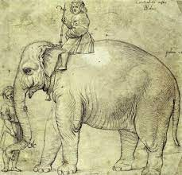

# Capítulo 04  - Título

<!-- ## Paineis de figuras -->

<!-- ::: {layout-ncol=2 layout-align="left"} -->
<!--  -->

<!--  -->

<!--  -->

<!--  -->
<!-- ::: -->

<!-- ## Subfiguras -->

<!-- De acordo com a @fig-elephants, mais especificamente, a @fig-surus -->

<!-- ::: {#fig-elephants layout-ncol=2} -->

<!-- {#fig-surus} -->

<!-- {#fig-hanno} -->

<!-- Famous Elephants -->
<!-- ::: -->


# Referenciando uma imagem

De acordo com a @fig-hanno...

{#fig-hanno}


# Referenciando uma imagem de código

De acordo com a @fig-grafico...

```{r}
#| label: fig-grafico
#| echo: false
#| fig-cap: Texto do gráfico

# Exemplo de grafico
plot(1:10)
```


